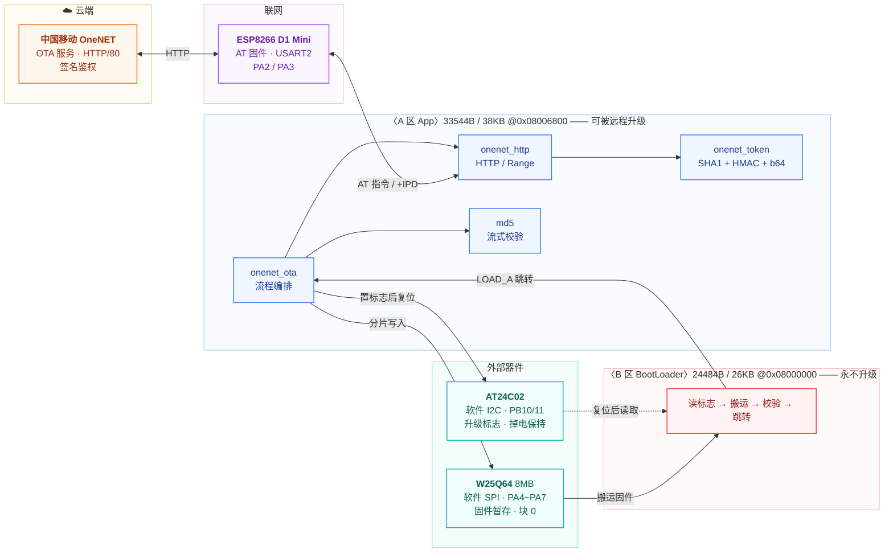

<div align="center">

# STM32F103 双区 OTA BootLoader + OneNET 云平台远程升级


设备运行时从 **中国移动 OneNET** 分片下载新固件写入外部 Flash，置标志后复位，<br/>
由 BootLoader 完成擦写、校验与跳转 —— **升级全程不接线、不接调试器**

</div>

---

## 亮点速览

| | |
|---|---|
| **双区 BootLoader** | 64KB 内部 Flash 划为 26KB BootLoader + 38KB 应用区，应用可被整体替换 |
| **云端远程升级** | 接入中国移动 OneNET OTA 服务，HTTP + `Range` 分片，33KB 固件分 33 片 |
| **设备侧签名** | MCU 上自实现 SHA1 + HMAC + base64，`accessKey` 不出设备 |
| **三道校验** | 传输 MD5 → W25Q64 回读 MD5 → AT24C02 标志回读，**全过才置升级标志** |
| **掉电安全** | 标志存 AT24C02，升级过程任意时刻断电都不会变砖 |
| **不需要硬件就能验证** | 6 个 PC 侧自动化测试脚本（签名 / CRC / MD5 / 分区宏 / +IPD 解析 / 服务协议）|

## 系统架构



---

## BootLoader 命令行

上电 5 秒内发送小写 `w` 进入菜单。**上位机不要勾"发送新行"** —— 命令按接收长度严格匹配，多一个 `\r\n` 会被静默忽略。

| 命令 | 功能 |
|---|---|
| `1` | 擦除 A 区 |
| `2` | 串口 Xmodem IAP 下载到 A 区 ← **变砖恢复通道** |
| `3` / `4` | 设置 / 查询 OTA 版本号 |
| `5` | 向外部 Flash 下载程序（可选块号 1~9）|
| `6` | 使用外部 Flash 中的程序（搬运到 A 区并跳转）|
| `7` | 复位 |

> 命令 `0` / `8` / `9` / `t` / `o`（内网 TCP OTA）已随 B 区精简移除，
> 实现全文在 git 提交 `b980c58` 里。

---

## 硬件连接

| 外设 | 接口 | 引脚 |
|---|---|---|
| OLED（SSD1306） | 软件 I2C | `PB8` = SCL，`PB9` = SDA |
| AT24C02（EEPROM） | 软件 I2C | `PB10` = SCL，`PB11` = SDA |
| W25Q64（SPI Flash） | 软件 SPI | `PA4` = CS，`PA5` = CLK，`PA6` = DO，`PA7` = DI |
| 上位机通信 | USART1 | `PA9` = TX，`PA10` = RX，**9600-8-N-1** |

> **注意**：本板上 OLED 模块的 GND / VCC 分别走 `PB6` / `PB7`，
> 这两个脚是**电源通路，不能当 GPIO 使用**，因此 AT24C02 的软件 I2C 改到了 `PB10` / `PB11`。
>
> **AT24C02 模块**的 `A0 / A1 / A2 / WP` 是三针跳线块（中间为信号，两侧为 VCC / GND）：
> 四个跳线帽都必须跨在 **GND 侧**，否则地址会变成 `0xAE`（代码用的是 `0xA0`）且写保护生效。

### 上位机串口设置

**不要勾选"发送新行"。** BootLoader 按接收长度严格匹配
（菜单命令要求 1 字节，版本号要求 26 字节），多出的 `\r\n` 会导致命令被静默忽略。

版本号格式：`VER-1.0.0-2026/09/20-15:30`（正好 26 字符）

### 串口输出是 UTF-8 中文 —— 上位机终端必须设成 UTF-8

这不是随手选的，是编码约束决定的：

**ARMCC 把源码字节原样写进 .o 文件** —— 字符串字面量的编码 = **源码文件的编码**。
实测（`UTF-8` / `UTF-8+BOM` / 各种 `--locale`、`--multibyte_chars` 组合）确认：
**没有任何编译选项能在编译期转换字符串编码** —— 源码是什么编码，串口就发什么字节。

| 源码编码 | 串口发出的字节 | GitHub 上中文注释 | 串口显示中文的前提 |
|---|---|---|---|
| **UTF-8**（本项目） | UTF-8 | ✅ 正常 | **上位机终端设成 UTF-8** |
| GBK | GBK | ❌ 乱码 | 终端按 GB2312 默认即可 |

本项目选 **UTF-8**：这样 **GitHub 的中文注释和串口的 UTF-8 中文可以同时成立**，
只要终端支持 UTF-8 —— 比二选一划算。

> **上位机设置**：Tera Term → `设置(Setup)` → `终端(Terminal)` → `汉字代码` 选 **UTF-8**。
> Xshell / SecureCRT / MobaXterm 也都有编码选项，同样选 UTF-8。
> 若用不支持 UTF-8 的老工具（部分国产串口助手没有编码选项），中文会显示为乱码 —— 换工具即可。

---

## Flash 分区规划

STM32F103C8T6 内部 Flash 共 64 KB（1 KB/页），划分为两个区：

```
0x08000000  ┌──────────────────────┐
            │   B 区：BootLoader   │  26 KB（26 页）
0x08006800  ├──────────────────────┤
            │   A 区：应用程序     │  38 KB（38 页）
0x0800FFFF  └──────────────────────┘
```

- **B 区**（`0x08000000`）：BootLoader 本体，不参与升级
- **A 区**（`0x08006800`）：应用程序。A 区工程需设置
  `IROM1 起始 0x08006800`（大小 `0x9800`），且 `VECT_TAB_OFFSET = 0x6800`（向量表重定位）

外部 W25Q64（8 MB）按 64 KB 块划分，**块 1~9** 各存放一个固件版本，
块 0 保留给升级流程使用。

---

## 项目结构

设备上真正运行的只有两个程序，它们接力完成一次升级：

| | **B 区 BootLoader** | **A 区 App** |
|---|---|---|
| 目录 | `6-串口IAP功能` | `1.1-(A区)串口测试程序` |
| 位置 / 容量 | `0x08000000` / 26KB | `0x08006800` / 38KB |
| 镜像 / 余量 | 24484B / 28672B | 33544B / 38912B |
| 职责 | 读标志 → 搬运 → 校验 → 跳转；串口 Xmodem IAP（**恢复通道**） | 业务 + **全部网络与云端逻辑** |
| 能否远程升级 | ❌ **不能**（设备上唯一修不好的代码） | ✅ 能 |

> **一句话规则：B 区冻结，A 区承担所有演进。**
> 因为 A 区能被 OneNET 升级、B 区不能 —— 这正是把 Flash 切成两块的**全部理由**。

此外还有 `1`~`5` 各阶段工程（学习过程的中间态）、`OTA升级原版/`（教程原版存档；
**里面的文件故意不带 BOM / 是 GBK，别用 `ensure_bom.py` 去"修"**），以及 `docs/` `scripts/` `_tools/`。

> ⚠️ **一条必须守住的纪律**：`ota_layout.h` 是 A/B 之间**唯一的契约**（两个工程没有函数调用，
> 只有那份内存布局）。改它必须两个工程一起重编、一起烧 —— 只烧一边会**静默失效**，不报错。
>
> 完整说明（含「哪些跟教程、哪些自己补」与**四次分区调整的历史**）见 → [`docs/project-structure.md`](docs/project-structure.md)


## 当前验证状态

> 这一节是简历和面试里「我说我做过」的唯一依据 —— 每条都写清验证到什么程度，**没验的绝不写"已验证"**。

| 层次 | 已验证到什么程度 |
|---|---|
| **B 区 BootLoader** | W25Q64 JEDEC ID / AT24C02 回环 / 命令 `1`~`7` 全部 / **EEPROM 掉电保持**（这是"升级能跨复位完成"的前提）|
| **设备侧签名** | SHA1 + HMAC + base64 自实现，开机自检 + 真机 `Token SelfTest: PASS` |
| **OneNET 六个接口** | `POST /version`、`GET /check`（`code:0` / `12012` / `12013` 三种都实际遇到过）、`GET /{tid}/download` + `Range`（`HTTP 206` + `Ota-Errno=0`）、`POST /{tid}/status` |
| **三道校验** | 传输 MD5（与平台逐字一致）· W25Q64 回读 33544B 重算 · AT24C02 标志回读（**写不进去就不复位**）|
| **端到端升级** | `1.0.0 → 1.1.0`：33 片下载 → 三道校验 → 置标志 → 复位 → BootLoader 搬运 → **`APP v1.1.0`** |
| **升级成功确认** | 新固件正常上报 `s_version=1.1.0` → 平台返回 `12012`，**任务自动闭环**（设备不需要记任何状态）|
| **上电硬件自检** | W25Q64 读 ID + AT24C02 回环；失败会**跳过 OTA** 并打印排查方向 |
| **OLED 显示** | 版本 / 自检结果 / OTA 实时进度 |
| **构建与版本管理** | 同一份源码双 Target 编出 `v1.0.0` / `v1.1.0`，用 grep `.bin` 核对过内容确实不同 |
| **PC 侧自动化测试** | 6 个脚本全绿（签名 / CRC / MD5 / 分区宏 / +IPD 解析 / 服务协议）—— **不需要硬件** |

> 上位机终端需设成 UTF-8（见上文）；命令 `0`/`8`/`9`/`t`/`o`（内网 TCP OTA）已随 B 区精简移除。


## 编译与烧录

- **IDE**：Keil MDK 5（ARMCC v5）
- **器件**：STM32F103C8
- **预处理宏**：`USE_STDPERIPH_DRIVER`（`STM32F10X_MD` 由 Keil 器件选择提供）
- **源码编码**：UTF-8 **带 BOM**。ARMCC5 默认按系统 ANSI 代码页解码源文件，
  UTF-8 无 BOM 时字符串字面量里的中文会被误解析，因此必须保留 BOM

**烧录**

1. 用 ST-Link 把 `6-串口IAP功能` 烧到 `0x08000000`（B 区）
2. 编译 `1.1-(A区)串口测试程序`，用 post-build 的 `fromelf` 生成 `.bin`
3. 该 `.bin` 就是后续通过 Xmodem 下发的固件

**串口工具**：Tera Term / SecureCRT / Xshell / MobaXterm 等支持 Xmodem-CRC 的工具。

- 波特率 9600，**不要勾"发送新行"**（命令按接收长度严格匹配）
- 终端编码设成 **UTF-8**（中文输出，见上一节）
- Xmodem 发送时：协议选 **`XMODEM`**（不是 `XMODEM(1K)`）、校验选 **`CRC`**（不是 `Checksum`）
- ⚠️ 别用只有"发送文件"功能的工具（如 SSCOM）—— 那是裸字节流，没有帧结构和 ACK，传不动

---

## 怎么跑一遍完整 OTA

> **升级过程不需要 ST-Link、不需要接串口线** —— 只要板子通电能上网。

**前置**：2.4GHz WiFi（⚠️ ESP8266 **不支持 5GHz**）、已建好的 OneNET 产品与设备、`onenet_cfg.h` 填好三元组。

**① 编两个版本**（同一份源码切 Keil 的 Target）

| Target | `APP_VERSION_ID` | 产物 | 用途 |
|---|---|---|---|
| `A-1.0.0` | `100` | `Objects_100/Project.bin` | **烧进设备**（扮演旧版本）|
| `A-1.1.0` | `110` | `Objects_110/Project.bin` | **传到平台**（升级包）|

> ⚠️ 编完**必须核对产物内容**。版本代号写错时编译器**不会报错**，只是制品里装着一个错的版本号 ——
> 后果是设备升级成功、但报给平台的版本号没变 → 平台认为没升上去 → **无限重刷**。

**② 烧 1.0.0 进设备** → **③ 上传升级包**（升级模块选 **MCU软件**）→
**④ 建「验证升级」任务**（⚠️ **上传包 ≠ 建任务**）→ **⑤ 复位设备，看它自己升级**

复位后约 45 秒，串口应打出：

```
[OTA] 有任务：tid=xxxxxxx  target=1.1.0  size=33544  md5=...
[OTA] 片 1/33  Range 0-1023              ← OLED 第 4 行同步刷新
...
[OTA] ✓ 传输校验通过      ← 第一道：传输 MD5
[OTA] ✓ 回读一致          ← 第二道：从 W25Q64 读回重算
[OTA] ✓ 标志回读确认       ← 第三道：AT24C02
        ↓ 复位 → BootLoader 搬运 → 跳转
APP v1.1.0                               ← ★ 升级成功
[OTA] 无待升级任务（code=12012）          ← ★ 平台自动闭环
```

> 每一步的详细操作、预期输出、**8 条常见问题速查**见 → [`docs/how-to-run.md`](docs/how-to-run.md)


## 固件下载工具（仓库自带）

除了图形化串口工具，仓库里带一个自实现的 **Xmodem-CRC 下载脚本** —— 它把
「发 `w` 进菜单 → 发 `2` → 等 `C` 握手 → 逐包发送 → EOT」整套动作编排好了，不用手动掐时机。

```bash
python scripts/xmodem_send.py --port COM20                          # 默认用 Objects_100 的固件
python scripts/xmodem_send.py --port COM20 --file "别的固件.bin"
```

`scriptslash.bat` 双击即用（默认 COM20 + 默认 A 区固件）。

> ⚠️ **`flash.bat` 是纯 ASCII 的，不是漏写中文** —— cmd.exe 按当前代码页逐行解析 `.bat`，
> 出现多字节字符会让它**中途中止**（窗口一闪就关，连 `pause` 都执行不到）。
> 所以中文提示全部由 Python 输出，批处理只做转发。

**已实测**：完整升级一次 —— 102 包全 ACK、零重传、826 B/s，复位后 A 区正常运行。
CRC-16/XMODEM（初值 `0x0000`、多项式 `0x1021`）与 `boot.c` 的 `Xmodem_CRC16()` 逐位等价，
并用 `binascii.crc_hqx` 交叉验证过。


## 自动化测试（不需要硬件）

`scripts/` 下有 **6 个可独立运行的测试**。改协议或改 CRC 之后先跑它们 —— 比烧板子快得多，
也能把「协议错了」和「硬件 / 链路问题」分开。

| 脚本 | 验什么 |
|---|---|
| `test_sign.py` | **OneNET 签名**：抽出真实的 `sha1.c` / `base64.c` / `onenet_token.c` 用 gcc 编译，跑已知向量，再与 Python 重算的 Authorization 串**逐字节**对账 |
| `test_md5.py` | **MD5 分片续算**：RFC 1321 向量 + 对真实固件用 **1024 / 256 / 7** 三种分片边收边算，三者必须与 `hashlib` 一致 |
| `test_macro_fix.py` | **分区宏展开**：从 `main.h` 抽宏原文编译运行，核对容量 / 页数 / 起址。这类 bug **编译链接都不报错**，只有数值默默变错 |
| `test_crc_equiv.py` | **CRC 零回归**：真实 `Xmodem_CRC16` 按「整段 / 每 256 字节续算 / 逐字节续算」三种方式跑，结果必须一致 |
| `test_payload_read.py` | **`+IPD` 状态机**：覆盖「载荷里含 `+IPD,999:` 字样」「信封被切成两半」「信封大于读批量」等边界 |
| `test_ota_server.py` | **内网 OTA 服务协议**：协议头格式 / 长度 / CRC / 固件逐字节一致，以及 `PING` 裸发回归 |

```bash
for t in sign md5 macro_fix crc_equiv payload_read ota_server; do python scripts/test_$t.py; done
```

> 多个测试开头会跑**已知向量自检**（如 CRC-16/XMODEM：`"123456789" → 0x31C3`）——
> 上位机与 MCU 两边的算法实现必须一致，靠肉眼比对代码看不出来，只能靠向量。
> `test_crc_equiv.py` 需要 gcc。


## 踩坑与缺陷记录

> 这个项目里**真正花了时间的不是写功能，而是排查那些"不报错但不对"的问题**。
> 完整记录（现象 / 定位过程 / 根因 / 教训）在 → **[docs/工程问题与踩坑记录.md](docs/工程问题与踩坑记录.md)**

| # | 问题 | 最值得记的一点 |
|---|---|---|
| 1 | **BootLoader 溢出到 A 区，把自己擦掉** | 「链接成功 ≠ 装得下」—— 必须拿镜像实际大小和分区容量**对账**（`fromelf --bin`）|
| 2 | **分区宏没括号，容量检查形同虚设** | 宏展开成 `(uint32_t)64 - 36*1024` 无符号回绕成 42 亿，判断永远为假。**没跑过反例，就没有证据说明校验有效** |
| 3 | **链接器消掉未引用的模块，量到了假的容量** | 加完 5 个驱动 `.bin` 只涨 200 字节——**量容量必须在代码真正调用之后量** |
| 4 | **漏了 I2C/SPI 初始化，固件和标志全写不进去** | 两个函数都不报错，MD5 还照样通过（它算的是 RAM）。**静默失败必须靠回读校验** |
| 5 | **同一类错误踩了两次：verbose 反复被打开** | 第一次修调用点、第二次才发现该修**层级**——**同类 bug 出现第二次，就说明修错了地方** |
| 6 | **版本号语义错，导致无限重刷** | 升级成功但版本没变 → 平台认为没升上去 → 反复下发。**版本号是状态机的输入，不是标签** |

> 第 3~6 条是接入 OneNET 云平台那段踩的，前两条是 BootLoader 阶段踩的。
> **面试里这几条比功能本身更有说服力** —— 它们证明的不只是"我做过"，而是"我会排查"。

## 已知限制

> 前两条已于 2026-09-20 修掉，定位与修复过程见 [工程问题与踩坑记录](docs/工程问题与踩坑记录.md)。

- ~~**Xmodem 尾包写入固定 4 页**，会把 `UpDataBuff` 里残留的旧包写进 W25Q64~~
  → **已修**：改为按实际数据量计算页数 `(rem+255)/256`
- ~~**命令解析严格匹配长度**，串口工具带换行符会导致命令被静默忽略~~
  → **已修**：裁掉末尾的 `\r\n`（**Xmodem 数据包不裁** —— 尾字节可能就是 0x0D/0x0A）
- **BootLoader 事件环形缓冲容量有限**（`usart.h` 的 `Num`，已由 10 增至 32）：
  `BootLoader_Enter()` 死等 5 秒期间主循环不消费事件，上位机若在这段窗口内高频
  刷字符仍可能冲爆缓冲 —— 当前 `In` 指针绕回会覆盖未消费槽位的 start/end 指针，
  导致之后的数据包被静默丢弃。**根治需要重做接收框架**，暂以扩大容量缓解。
  图形化工具手动操作不会触发

---

## 文档

- [AT24C02 上电自检故障排查记录](docs/AT24C02-调试记录.md)
- [工程问题与踩坑记录](docs/工程问题与踩坑记录.md) —— Flash 分区溢出、编码取舍、
  下载工具链、以及两个框架层面的脆弱点：重点记**怎么定位的**，不只是怎么修的
- `scripts/README` 相关见上文「固件下载工具」
- `OTA学习笔记.md` —— 开发过程中的分段笔记
